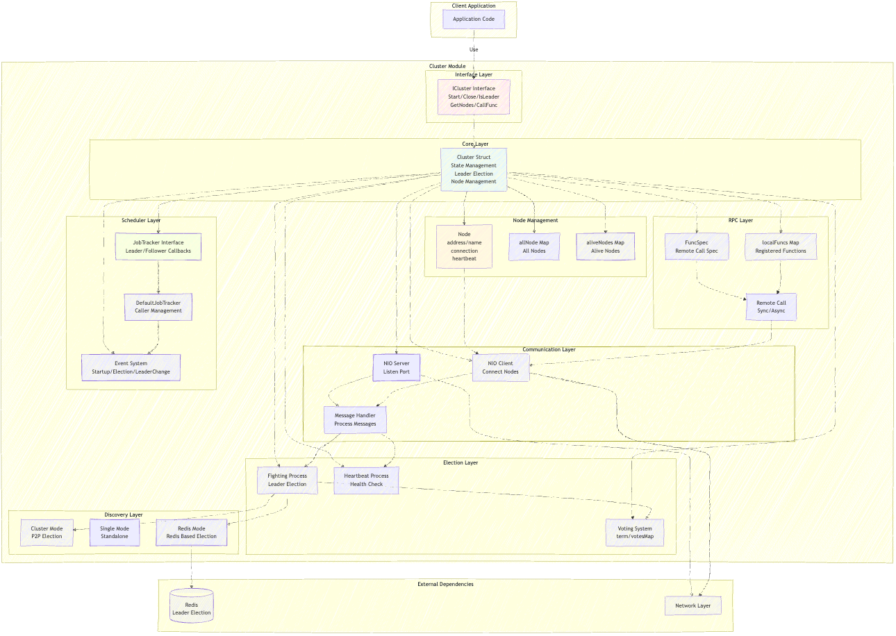

# Cluster 集群管理模块使用文档

## 概述

`cluster` 包提供了一个基于 Raft 共识算法的分布式集群管理解决方案，支持主节点选举、心跳检测、远程调用和任务调度等功能。该模块可以用于构建高可用的分布式系统。

## 架构图



## 核心特性

- **多种集群模式**：支持 `cluster`（标准集群）、`single`（单机模式）、`redis`（基于 Redis 的选主）三种模式
- **自动选主**：基于 Raft 算法实现的自动主节点选举机制
- **心跳检测**：主节点定期向从节点发送心跳，确保集群健康
- **故障恢复**：主节点宕机后自动重新选举
- **远程调用**：支持跨节点的函数调用（同步/异步）
- **任务调度**：基于集群状态的任务调度器
- **Kubernetes 支持**：支持通过 ReplicasDiscovery 自动发现 K8s 集群节点
- **动态扩缩容**：支持运行时动态重新加载节点列表

## 快速开始

### 1. 基本使用（标准集群模式）

```go
package main

import (
    "github.com/caiflower/common-tools/cluster"
    "github.com/caiflower/common-tools/pkg/logger"
    "time"
)

func main() {
    // 创建集群配置
    config := cluster.Config{
        Mode:    "cluster",  // 集群模式
        Timeout: 10,         // 心跳超时时间（秒）
        Enable:  "true",     // 启用集群
    }
    
    // 配置节点列表
    config.Nodes = []*struct {
        Name  string
        Ip    string
        Port  int
        Local bool
    }{
        {Name: "node1", Ip: "192.168.1.10", Port: 8080},
        {Name: "node2", Ip: "192.168.1.11", Port: 8080},
        {Name: "node3", Ip: "192.168.1.12", Port: 8080},
    }
    
    // 创建集群实例
    c, err := cluster.NewCluster(config)
    if err != nil {
        panic(err)
    }
    
    // 启动集群
    c.Start()
    
    // 等待集群就绪
    for !c.IsReady() {
        time.Sleep(time.Second)
    }
    
    // 检查当前节点角色
    if c.IsLeader() {
        println("我是主节点")
    } else {
        println("我是从节点，主节点是:", c.GetLeaderName())
    }
    
    // 优雅关闭
    defer c.Close()
}
```

### 2. 单机模式

单机模式适用于开发测试或不需要高可用的场景：

```go
config := cluster.Config{
    Mode:   "single",
    Enable: "true",
}

c, err := cluster.NewCluster(config)
if err != nil {
    panic(err)
}

c.Start()
```

### 3. Redis 模式

基于 Redis 的选主模式，适用于无法直接节点间通信的场景：

```go
import (
    "github.com/caiflower/common-tools/cluster"
    redisv1 "github.com/caiflower/common-tools/redis/v1"
)

// 创建 Redis 客户端
redisClient := redisv1.NewRedisClient(redisv1.Config{
    Addrs:    []string{"localhost:6379"},
    Password: "",
    DB:       0,
})

// 配置 Redis 选主参数
config := cluster.Config{
    Mode:   "redis",
    Enable: "true",
    RedisDiscovery: cluster.RedisDiscovery{
        BeanName:           "",  // 留空则使用 IoC 自动注入
        DataPath:           "/cluster/election",
        ElectionInterval:   5 * time.Second,  // 选举/续约间隔
        ElectionPeriod:     10 * time.Second, // 租期时长
        SyncLeaderInterval: 5 * time.Second,  // 同步主节点间隔
    },
}

config.Nodes = []*struct {
    Name  string
    Ip    string
    Port  int
    Local bool
}{
    {Name: "node1", Ip: "127.0.0.1", Port: 8080},
    {Name: "node2", Ip: "127.0.0.1", Port: 8081},
}

c, err := cluster.NewCluster(config)
if err != nil {
    panic(err)
}

c.Redis = redisClient
c.Start()
```

### 4. Kubernetes 模式（自动节点发现）

在 Kubernetes 环境中，可以使用 ReplicasDiscovery 自动发现集群节点：

```go
config := cluster.Config{
    Mode:    "cluster",
    Timeout: 10,
    Enable:  "true",
    ReplicasDiscovery: cluster.ReplicasDiscovery{
        DomainPatten: "my-service-{suf}.my-namespace.svc.cluster.local",  // 域名模式，{suf} 会被替换为序号
        Port:         8080,      // 服务端口
        Replicas:     3,         // 副本数（可选，默认从环境变量读取）
    },
}

c, err := cluster.NewCluster(config)
if err != nil {
    panic(err)
}

c.Start()
```

## 核心接口

### ICluster 接口

```go
type ICluster interface {
    // 生命周期管理
    Name() string                          // 获取集群名称
    Start() error                          // 启动集群
    Close()                                // 关闭集群
    
    // 状态查询
    IsFighting() bool                      // 是否正在选举
    IsClose() bool                         // 是否已关闭
    IsReady() bool                         // 是否就绪
    IsLeader() bool                        // 当前节点是否是主节点
    IsCandidate() bool                     // 当前节点是否是候选人
    IsFollower() bool                      // 当前节点是否是从节点
    
    // 节点信息
    GetLeaderNode() *Node                  // 获取主节点
    GetLeaderName() string                 // 获取主节点名称
    GetMyNode() *Node                      // 获取本节点
    GetMyName() string                     // 获取本节点名称
    GetMyTerm() int                        // 获取当前任期
    GetMyAddress() string                  // 获取本节点通信地址
    GetNodeByName(name string) *Node       // 根据名称获取节点
    
    // 节点统计
    GetAllNodeNames() []string             // 获取所有节点名称
    GetAllNodeCount() int                  // 获取所有节点数量
    GetAliveNodeNames() []string           // 获取存活节点名称
    GetAliveNodeCount() int                // 获取存活节点数量
    GetLostNodeNames() []string            // 获取失联节点名称
    
    // 任务调度
    AddJobTracker(v JobTracker) error      // 添加任务调度器
    RemoveJobTracker(v JobTracker)         // 移除任务调度器
    
    // 远程调用
    RegisterFunc(funcName string, fn func(data interface{}) (interface{}, error))
    CallFunc(fc *FuncSpec) (interface{}, error)
}
```

## 远程调用

集群支持跨节点的函数调用，分为同步调用和异步调用两种模式。

### 注册函数

首先在所有节点上注册需要远程调用的函数：

```go
// 定义一个可以被远程调用的函数
func processData(data interface{}) (interface{}, error) {
    input := data.(string)
    result := "处理结果: " + input
    return result, nil
}

// 在集群节点上注册函数
c.RegisterFunc("processData", processData)
```

### 同步调用

同步调用会阻塞等待结果返回：

```go
// 创建同步调用规格
// 参数：目标节点名称、函数名、参数、超时时间
funcSpec := cluster.NewFuncSpec("node2", "processData", "test data", 3*time.Second)

// 可选：设置追踪ID
funcSpec.SetTraceId("trace-123")

// 执行调用
result, err := c.CallFunc(funcSpec)
if err != nil {
    fmt.Printf("调用失败: %v\n", err)
} else {
    fmt.Printf("调用结果: %v\n", result)
}
```

### 异步调用

异步调用立即返回，可以稍后获取结果：

```go
// 创建异步调用规格
funcSpec := cluster.NewAsyncFuncSpec("node2", "processData", "async data", 3*time.Second)

// 发起异步调用（不等待）
_, _ = c.CallFunc(funcSpec)

// 稍后获取结果
time.Sleep(time.Second)
result, err := funcSpec.GetResult()
if err != nil {
    fmt.Printf("调用失败: %v\n", err)
} else if result != nil {
    fmt.Printf("调用结果: %v\n", result)
} else {
    fmt.Println("结果尚未返回")
}
```

### 忽略集群未就绪

在某些场景下，你可能希望在集群未就绪时也能发起调用：

```go
funcSpec := cluster.NewFuncSpec("node2", "processData", "data", 3*time.Second)
funcSpec.IgnoreNotReady()  // 忽略集群未就绪状态
```

### 自定义属性

FuncSpec 支持设置和获取自定义属性：

```go
funcSpec := cluster.NewFuncSpec("node2", "processData", "data", 3*time.Second)
funcSpec.SetAttribute("customKey", "customValue")
value := funcSpec.GetAttribute("customKey")
```

## 任务调度器

任务调度器允许在集群状态变化时执行特定逻辑。

### 自定义 JobTracker

实现 `JobTracker` 接口来定义自己的调度逻辑：

```go
type MyJobTracker struct {
    cluster cluster.ICluster
}

func (t *MyJobTracker) Name() string {
    return "MyJobTracker"
}

// 当节点成为主节点时调用
func (t *MyJobTracker) OnStartedLeading() {
    fmt.Println("我成为主节点了，开始执行主节点任务")
    // 执行主节点特有的任务
}

// 当节点失去主节点身份时调用
func (t *MyJobTracker) OnStoppedLeading() {
    fmt.Println("我不再是主节点")
    // 停止主节点任务
}

// 当节点开始跟随主节点时调用
func (t *MyJobTracker) OnStartedFollowing(leaderName string) {
    fmt.Printf("开始跟随主节点: %s\n", leaderName)
    // 执行从节点任务
}

// 当节点停止跟随主节点时调用
func (t *MyJobTracker) OnStoppedFollowing() {
    fmt.Println("停止跟随主节点")
}

// 注册到集群
tracker := &MyJobTracker{cluster: c}
c.AddJobTracker(tracker)
```

### 使用 DefaultJobTracker

框架提供了默认的任务调度器实现：

```go
type MyCaller struct {
    cluster.DefaultCaller  // 嵌入默认实现
}

// 主节点定时任务
func (c *MyCaller) MasterCall() {
    fmt.Println("执行主节点定时任务")
    // 例如：清理过期数据、生成报表等
}

// 从节点定时任务
func (c *MyCaller) SlaverCall(leaderName string) {
    fmt.Printf("执行从节点定时任务，当前主节点: %s\n", leaderName)
    // 例如：同步数据、健康检查等
}

func (c *MyCaller) OnStartedLeading() {
    fmt.Println("成为主节点回调")
}

func (c *MyCaller) OnStoppedLeading() {
    fmt.Println("失去主节点身份回调")
}

func (c *MyCaller) OnStartedFollowing(leaderName string) {
    fmt.Printf("开始跟随主节点: %s\n", leaderName)
}

func (c *MyCaller) OnStoppedFollowing() {
    fmt.Println("停止跟随主节点")
}

// 创建调度器
caller := &MyCaller{}
tracker := cluster.NewDefaultJobTracker(
    10,      // 定时任务间隔（秒）
    caller,  // 回调实现
)

// 注册到集群
c.AddJobTracker(tracker)
```

### 关闭 DefaultJobTracker

DefaultJobTracker 实现了 `Close()` 方法，可以在关闭时清理资源：

```go
tracker := cluster.NewDefaultJobTracker(10, caller)
defer tracker.Close()  // 优雅关闭
```

## 配置详解

### Config 结构

```go
type Config struct {
    Mode    string  // 模式: "cluster", "single", "redis"
    Timeout int     // 心跳超时时间（秒），默认 10
    Enable  string  // 是否启用集群: "true" 或 "false"，默认 "false"
    
    // 节点配置列表
    Nodes []*struct {
        Name  string  // 节点名称（唯一）
        Ip    string  // 节点IP
        Port  int     // 节点端口
        Local bool    // 是否是本地节点（测试用）
    }
    
    // Redis 模式配置
    RedisDiscovery RedisDiscovery
    
    // Kubernetes 自动发现配置
    ReplicasDiscovery ReplicasDiscovery
}
```

### RedisDiscovery 配置

```go
type RedisDiscovery struct {
    BeanName           string        // Redis Bean 名称（IoC注入用），为空则自动注入
    DataPath           string        // Redis 存储路径
    ElectionInterval   time.Duration // 选举/续约间隔（默认 15s）
    ElectionPeriod     time.Duration // 租期时长（默认 30s）
    SyncLeaderInterval time.Duration // 同步主节点间隔（默认 10s）
}
```

### ReplicasDiscovery 配置

```go
type ReplicasDiscovery struct {
    DomainPatten string  // 域名模式，{suf} 会被替换为序号
    Port         int     // 服务端口，默认 8081
    Replicas     int     // 副本数（可选，默认从环境变量读取）
}
```

**使用示例**：

```go
// 在 Kubernetes 环境中，假设有一个 StatefulSet，服务名为 my-service
// Pod 域名格式为：my-service-0.my-namespace.svc.cluster.local
// 可以使用以下配置自动发现节点：

config.ReplicasDiscovery = cluster.ReplicasDiscovery{
    DomainPatten: "my-service-{suf}.my-namespace.svc.cluster.local",
    Port:         8080,
    Replicas:     3,  // 可选，不填则从环境变量读取
}
```

## 集群事件

集群在运行过程中会产生以下事件：

- `StartUp`: 集群启动
- `SignMaster`: 成为主节点
- `SignFollower`: 成为从节点
- `UnsignMaster`: 失去主节点身份
- `UnsignFollower`: 失去从节点身份
- `ElectionStart`: 选举开始
- `ElectionFinish`: 选举结束
- `Close`: 集群关闭

这些事件会触发 JobTracker 的相应回调方法。

## 动态扩缩容

集群支持运行时动态重新加载节点列表，适用于 Kubernetes 等动态环境。

### 自动扩缩容

当使用 `ReplicasDiscovery` 配置时，集群会自动处理扩缩容：

```go
config.ReplicasDiscovery = cluster.ReplicasDiscovery{
    DomainPatten: "my-service-{suf}.my-namespace.svc.cluster.local",
    Port:         8080,
}
```

- **启动时**：集群会自动连接所有副本节点
- **关闭时**：集群会通知其他节点重新加载节点列表
- **扩容时**：新节点启动后会通知现有节点重新加载

### 手动重新加载节点

你也可以手动触发节点重新加载：

```go
// 调用内置的远程函数重新加载节点
_, err := c.CallFunc(
    cluster.NewFuncSpec("node2", "cluster.ReloadAllNodes", 3, 2*time.Second),
)
```

## 最佳实践

### 1. 节点配置

- 建议奇数个节点（3、5、7 等），以保证选举的有效性
- 至少 3 个节点才能保证高可用
- 节点间网络延迟应尽可能低

### 2. 超时设置

```go
config.Timeout = 10  // 心跳超时 10 秒

// Redis 模式建议配置
config.RedisDiscovery.ElectionInterval = 5 * time.Second   // 5秒续约一次
config.RedisDiscovery.ElectionPeriod = 10 * time.Second    // 租期10秒
config.RedisDiscovery.SyncLeaderInterval = 3 * time.Second // 3秒同步一次
```

**注意**: `ElectionPeriod` 应大于 `ElectionInterval`，确保续约期间不会过期。

### 3. 节点识别

生产环境建议通过环境变量或配置自动识别当前节点：

```go
import "github.com/caiflower/common-tools/global/env"

// 框架会自动调用 env.GetLocalDNS() 和 env.GetLocalHostIP()
// 无需手动配置 Local 字段
```

### 4. 优雅关闭

```go
import (
    "github.com/caiflower/common-tools/global"
    "os"
    "os/signal"
    "syscall"
)

func main() {
    c, _ := cluster.NewCluster(config)
    c.Start()
    
    // 注册到全局资源管理器
    global.DefaultResourceManger.Add(c)
    
    // 监听系统信号
    sigChan := make(chan os.Signal, 1)
    signal.Notify(sigChan, syscall.SIGINT, syscall.SIGTERM)
    
    <-sigChan
    
    // 触发优雅关闭
    global.DefaultResourceManger.Signal()
}
```

### 5. 远程调用注意事项

- 被调用的函数必须在所有节点上注册
- 注意超时时间设置，避免长时间阻塞
- 异步调用需要定期检查结果或设置合理的超时
- 传递的参数必须可序列化（建议使用基本类型、结构体）
- 使用 `IgnoreNotReady()` 可以在集群未就绪时发起调用

### 6. 任务调度建议

- `MasterCall` 适合执行只需要主节点执行的任务（如定时清理、报表生成）
- `SlaverCall` 适合执行需要所有节点执行的任务（如健康检查、数据同步）
- 避免在回调中执行耗时过长的操作，建议使用 goroutine
- 记得在关闭时调用 `tracker.Close()` 清理资源

### 7. Kubernetes 部署建议

```go
// 使用 ReplicasDiscovery 自动发现节点
config.ReplicasDiscovery = cluster.ReplicasDiscovery{
    DomainPatten: "my-service-{suf}.my-namespace.svc.cluster.local",
    Port:         8080,
}

// 不要手动配置 Nodes 字段，让框架自动发现
```

## 常见问题

### Q1: 集群一直无法选出主节点？

**原因**:
- 节点数量不足（少于半数节点在线）
- 网络不通，节点间无法通信
- 防火墙阻止了端口访问

**解决方法**:
```go
// 检查存活节点数量
aliveCount := c.GetAliveNodeCount()
allCount := c.GetAllNodeCount()
fmt.Printf("存活节点: %d/%d\n", aliveCount, allCount)

// 检查失联节点
lostNodes := c.GetLostNodeNames()
fmt.Printf("失联节点: %v\n", lostNodes)
```

### Q2: 主节点宕机后多久会重新选举？

通常在 `Timeout * 2` 秒内完成重新选举。例如 `Timeout=10`，则约 20 秒内完成。

### Q3: Redis 模式和 Cluster 模式有什么区别？

| 特性 | Cluster 模式 | Redis 模式 |
|------|-------------|-----------|
| 节点间通信 | TCP 直连 | 通过 Redis |
| 性能 | 高 | 中 |
| 部署复杂度 | 需要节点间网络互通 | 只需连接 Redis |
| 适用场景 | 内网环境 | Kubernetes、容器化环境 |
| 远程调用 | 支持 | 不支持 |

### Q4: 如何处理网络分区？

集群基于 Raft 算法，遵循"多数派"原则：
- 拥有超过半数节点的分区会继续工作
- 少数派分区会停止工作，等待网络恢复
- 确保集群节点数为奇数可以避免平票

### Q5: 如何监控集群状态？

```go
// 定期检查集群状态
ticker := time.NewTicker(10 * time.Second)
go func() {
    for range ticker.C {
        if c.IsReady() {
            fmt.Printf("集群健康 | 主节点: %s | 任期: %d | 存活: %d/%d\n",
                c.GetLeaderName(),
                c.GetMyTerm(),
                c.GetAliveNodeCount(),
                c.GetAllNodeCount(),
            )
        } else {
            fmt.Println("集群异常，正在选举...")
        }
    }
}()
```

### Q6: Kubernetes 环境下如何配置？

使用 `ReplicasDiscovery` 配置自动发现：

```go
config.ReplicasDiscovery = cluster.ReplicasDiscovery{
    DomainPatten: "my-service-{suf}.my-namespace.svc.cluster.local",
    Port:         8080,
}
```

确保：
1. 使用 StatefulSet 部署
2. 创建 Headless Service
3. Pod 域名格式正确

### Q7: 如何实现动态扩缩容？

使用 `ReplicasDiscovery` 配置后，扩缩容会自动处理：

```go
// 扩容：增加副本数，新 Pod 启动后会自动加入集群
// 缩容：减少副本数，Pod 关闭时会通知其他节点重新加载
```

## 示例代码

### 完整示例：带任务调度的集群

```go
package main

import (
    "fmt"
    "time"
    "github.com/caiflower/common-tools/cluster"
    "github.com/caiflower/common-tools/pkg/logger"
    "github.com/caiflower/common-tools/global"
)

type BusinessCaller struct {
    cluster.DefaultCaller
    name string
}

func (c *BusinessCaller) OnStartedLeading() {
    fmt.Printf("[%s] 我成为了主节点！\n", c.name)
}

func (c *BusinessCaller) OnStoppedLeading() {
    fmt.Printf("[%s] 我失去了主节点身份\n", c.name)
}

func (c *BusinessCaller) OnStartedFollowing(leaderName string) {
    fmt.Printf("[%s] 开始跟随主节点: %s\n", c.name, leaderName)
}

func (c *BusinessCaller) OnStoppedFollowing() {
    fmt.Printf("[%s] 停止跟随主节点\n", c.name)
}

func (c *BusinessCaller) MasterCall() {
    fmt.Printf("[%s] 执行主节点任务 - %s\n", c.name, time.Now().Format("15:04:05"))
    // 这里执行主节点专属任务
    // 例如：清理过期数据、生成统计报表等
}

func (c *BusinessCaller) SlaverCall(leaderName string) {
    fmt.Printf("[%s] 从节点任务 - 主节点是 %s - %s\n", 
        c.name, leaderName, time.Now().Format("15:04:05"))
    // 这里执行从节点任务
    // 例如：健康检查、数据同步等
}

func main() {
    // 配置集群
    config := cluster.Config{
        Mode:    "cluster",
        Timeout: 10,
        Enable:  "true",
    }
    
    config.Nodes = []*struct {
        Name  string
        Ip    string
        Port  int
        Local bool
    }{
        {Name: "node1", Ip: "127.0.0.1", Port: 8080, Local: true},  // 当前节点
        {Name: "node2", Ip: "127.0.0.1", Port: 8081},
        {Name: "node3", Ip: "127.0.0.1", Port: 8082},
    }
    
    // 创建集群
    c, err := cluster.NewCluster(config)
    if err != nil {
        panic(err)
    }
    
    // 创建业务调度器
    caller := &BusinessCaller{name: "node1"}
    tracker := cluster.NewDefaultJobTracker(5, caller)  // 每5秒执行一次
    // 注册到集群
    c.AddJobTracker(tracker)
    global.DefaultResourceManger.AddDaemon(c)
    
    // 注册远程调用函数
    c.RegisterFunc("hello", func(data interface{}) (interface{}, error) {
        name := data.(string)
        return fmt.Sprintf("Hello, %s!", name), nil
    })
    
    // 等待集群就绪
    for !c.IsReady() {
        time.Sleep(time.Second)
    }
    
    // 如果是主节点，尝试远程调用
    if c.IsLeader() {
        time.Sleep(3 * time.Second)
        targetNode := "node2"  // 调用 node2
        result, err := c.CallFunc(
            cluster.NewFuncSpec(targetNode, "hello", "World", 3*time.Second),
        )
        if err != nil {
            fmt.Printf("远程调用失败: %v\n", err)
        } else {
            fmt.Printf("远程调用结果: %v\n", result)
        }
    }
    
    // 优雅关闭
    global.DefaultResourceManger.Signal()
}
```

### Kubernetes 部署示例

```go
package main

import (
    "github.com/caiflower/common-tools/cluster"
    "github.com/caiflower/common-tools/pkg/logger"
)

func main() {
    // 使用 ReplicasDiscovery 自动发现节点
    config := cluster.Config{
        Mode:    "cluster",
        Timeout: 10,
        Enable:  "true",
        ReplicasDiscovery: cluster.ReplicasDiscovery{
            DomainPatten: "my-service-{suf}.my-namespace.svc.cluster.local",
            Port:         8080,
        },
    }
    
    c, err := cluster.NewCluster(config)
    if err != nil {
        panic(err)
    }
    
    c.Start()
    
    // 等待集群就绪
    for !c.IsReady() {
        time.Sleep(time.Second)
    }
    
    fmt.Printf("集群就绪，主节点: %s\n", c.GetLeaderName())
}
```

## 总结

`cluster` 包提供了完整的分布式集群管理能力，适用于需要高可用、主从选举的场景。通过简单的配置即可实现：

✅ 自动主节点选举  
✅ 故障自动恢复  
✅ 跨节点远程调用  
✅ 灵活的任务调度  
✅ 多种部署模式  
✅ Kubernetes 自动发现  
✅ 动态扩缩容支持  

建议根据实际部署环境选择合适的集群模式，并合理配置超时参数以保证系统稳定性。
