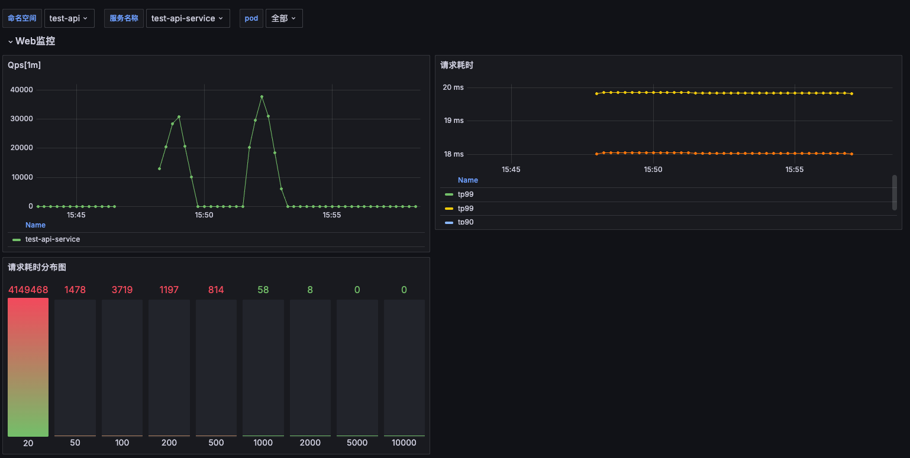
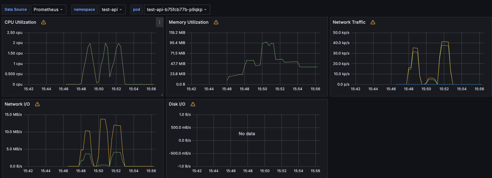

# Web框架使用指南

## 概述

Web包是一个轻量级的RESTful Web框架，提供HTTP服务器、请求路由、参数校验、拦截器等功能。支持两种请求风格：
- **Action风格**：基于查询参数 `?action=xxx` 的传统风格
- **RESTful风格**：基于HTTP方法和路径的REST API风格


---
在CPU为Intel(R) Xeon(R) Platinum 8338C CPU，2c4g条件下，使用wrk工具压测，结果如下：
```bash
[root@k8s-node3 ~]# wrk -t12 -c500 -d60s http://127.0.0.1:30461/v1/req
Running 1m test @ http://127.0.0.1:30461/v1/req
  12 threads and 500 connections
  Thread Stats   Avg      Stdev     Max   +/- Stdev
    Latency    53.00ms   81.36ms   1.14s    85.02%
    Req/Sec     2.63k     0.86k   10.88k    74.65%
  1882444 requests in 1.00m, 454.20MB read
  Non-2xx or 3xx responses: 1882444
Requests/sec:  31359.32
Transfer/sec:      7.57MB
[root@k8s-node3 ~]# wrk -t12 -c500 -d60s http://127.0.0.1:30461/e
Running 1m test @ http://127.0.0.1:30461/e
  12 threads and 500 connections
  Thread Stats   Avg      Stdev     Max   +/- Stdev
    Latency    55.69ms   81.65ms 795.35ms   83.57%
    Req/Sec     3.17k     1.13k   11.95k    74.39%
  2273335 requests in 1.00m, 526.83MB read
  Non-2xx or 3xx responses: 2273335
Requests/sec:  37873.98
Transfer/sec:      8.78MB
```




## 使用介绍

### 1. 初始化HTTP服务器

使用 `web.Default` 方法并通过 Option 模式进行配置初始化。

```go
import (
    "github.com/caiflower/common-tools/web"
    "github.com/caiflower/common-tools/web/server/config"
)

// 初始化服务器
server := web.Default(
    config.WithName("myapp"),
    config.WithAddr(":8080"),
    config.WithReadTimeout(20 * time.Second),
    config.WithWriteTimeout(35 * time.Second),
    config.WithRootPath("/api"),
    config.WithControllerRootPkgName("controller"),
    config.WithEnablePprof(false),
    config.WithQps(true, 1000), // 开启限流，QPS=1000
)

server.Start()
```

### 2. 定义Controller

#### Action风格示例

```go
package controller

import (
    "github.com/caiflower/common-tools/web/common/e"
)

type UserController struct {
}

// 定义请求参数结构体
type GetUserReq struct {
    ID int `json:"id" verf:"required"`
}

// 定义响应结构体
type User struct {
    ID   int    `json:"id"`
    Name string `json:"name"`
}

// 定义处理方法，返回 (data, error)
func (c *UserController) GetUser(req *GetUserReq) (*User, error) {
    return &User{ID: req.ID, Name: "John"}, nil
}

// 处理错误返回 ApiError
func (c *UserController) DeleteUser(req *GetUserReq) (interface{}, e.ApiError) {
    if req.ID <= 0 {
        return nil, e.NewApiError(e.InvalidArgument, "Invalid ID", nil)
    }
    return nil, nil
}
```

**Action风格请求**：
```
POST /api/UserController?Action=GetUser
Content-Type: application/json

{
    "id": 1
}
```

#### RESTful风格示例

```go
package controller

type ProductController struct {
}

type CreateProductReq struct {
    Name  string  `json:"name" verf:"required"`
    Price float64 `json:"price" verf:"required"`
}

type GetProductReq struct {
    ID string `path:"productId" verf:"required"`
}

type Product struct {
    ID    string  `json:"id"`
    Name  string  `json:"name"`
    Price float64 `json:"price"`
}

func (c *ProductController) CreateProduct(req *CreateProductReq) (*Product, error) {
    return &Product{
        ID:    "prod-123",
        Name:  req.Name,
        Price: req.Price,
    }, nil
}

func (c *ProductController) GetProductByID(req *GetProductReq) (*Product, error) {
    return &Product{
        ID:    req.ID,
        Name:  "Test Product",
        Price: 99.99,
    }, nil
}
```

### 3. 注册Controller

```go
// 注册 Controller 到服务器
// 这会自动注册 Action 风格的路由，并返回 *controller.Controller 实例供 RESTful 注册使用
userController := server.AddController(&UserController{})
productController := server.AddController(&ProductController{})
```

### 4. 注册RESTful路由

RESTful 路由需要显式注册，通过 `controller.NewRestFul()` 构建路由规则，并绑定到具体的 Controller 方法上。

```go
import (
    "github.com/caiflower/common-tools/web/router/controller"
)

// 创建路由组
group := controller.NewRestFul().Group("/v1/products")

// 注册 POST /v1/products
server.Register(group.
    Method("POST").
    RegisterMethod(productController.GetMethod("CreateProduct")),
)

// 注册 GET /v1/products/:productId
server.Register(group.
    Method("GET").
    Path("/:productId").
    RegisterMethod(productController.GetMethod("GetProductByID")),
)
```

**RESTful风格请求**：
```
POST /api/v1/products HTTP/1.1
Content-Type: application/json

{
    "name": "Product Name",
    "price": 99.99
}

GET /api/v1/products/prod-123 HTTP/1.1
```

---

## 核心功能

### 请求参数绑定

支持从多个来源自动绑定参数：

#### JSON Body绑定（POST/PUT/PATCH/DELETE）

```go
type UserReq struct {
    Name  string `json:"name"`
    Email string `json:"email"`
}
```

#### 查询参数绑定（GET/Action风格）

使用 `json` tag 或 `query` tag 绑定查询参数。

```go
type SearchReq struct {
    Keyword string `query:"keyword"` // 推荐使用 query tag
    Page    int    `json:"page"`     // 兼容 json tag
}

func (c *UserController) Search(req *SearchReq) (interface{}, error) {
    // ?keyword=test&page=1
    return nil, nil
}
```

#### 路径参数绑定（RESTful风格）

使用 `path` tag 绑定 URL 路径参数。

```go
type GetProductReq struct {
    ProductID    string `path:"productId"`
    SubProductID string `path:"subProductId"`
}

func (c *ProductController) GetProduct(req *GetProductReq) (*Product, error) {
    // 对应路由路径：/products/:productId/sub/:subProductId
    return &Product{ID: req.ProductID}, nil
}
```

#### 请求头绑定

```go
type AuthReq struct {
    Authorization string `header:"Authorization"`
    ContentType   string `header:"Content-Type"`
}
```

#### 默认值设置

```go
type PageReq struct {
    Page  int `json:"page" default:"1"`
    Size  int `json:"size" default:"10"`
}
```

### 参数校验

框架支持丰富的参数校验标签 `verf`：

#### 必填校验

```go
type UserReq struct {
    Name string `json:"name" verf:"required"` // 必填
}
```

#### 枚举值校验

```go
type OrderReq struct {
    Status string `json:"status" inList:"pending,processing,completed"`
}
```

#### 正则表达式校验

```go
type EmailReq struct {
    Email string `json:"email" reg:"^[a-zA-Z0-9._%+-]+@[a-zA-Z0-9.-]+\\.[a-zA-Z]{2,}$"`
}
```

#### 范围校验

```go
type AgeReq struct {
    Age int `json:"age" between:"0,150"`
}
```

#### 长度校验

```go
type PasswordReq struct {
    Password string `json:"password" len:"8,32"` // 长度8-32
}
```

#### 数组元素长度校验

```go
type TagsReq struct {
    Tags []string `json:"tags" itemLen:"1,20"` // 每个元素长度1-20
}
```

#### 可选字段

```go
type FilterReq struct {
    Category *string `json:"category" verf:"nilable"` // 可选，可以为nil
}
```

### 响应格式

框架自动将方法返回值封装为统一的响应格式：

#### 成功响应

```json
{
    "requestId": "550e8400-e29b-41d4-a716-446655440000",
    "data": {
        "id": 1,
        "name": "Product Name"
    }
}
```

#### 错误响应

```json
{
    "requestId": "550e8400-e29b-41d4-a716-446655440000",
    "error": {
        "code": 400,
        "type": "InvalidArgument",
        "message": "Invalid input parameters"
    }
}
```

### 错误处理

支持多种错误返回方式，推荐使用 `web/common/e` 包中的错误类型：

```go
import "github.com/caiflower/common-tools/web/common/e"

// 方式1：返回 error
func (c *Controller) Method1(req *Req) (*Resp, error) {
    return nil, fmt.Errorf("error message")
}

// 方式2：返回 ApiError
func (c *Controller) Method2(req *Req) (*Resp, e.ApiError) {
    return nil, e.NewApiError(e.InvalidArgument, "Invalid argument", nil)
}
```

### 拦截器

实现 `Interceptor` 接口进行请求拦截：

```go
package interceptor

import (
    "github.com/caiflower/common-tools/web/common/e"
    "github.com/caiflower/common-tools/web/common/webctx"
    "github.com/caiflower/common-tools/web/common/interceptor"
)

type LoggingInterceptor struct {
}

func (l *LoggingInterceptor) Before(ctx *webctx.Context) e.ApiError {
    // 业务执行前
    return nil
}

func (l *LoggingInterceptor) After(ctx *webctx.Context, err e.ApiError) e.ApiError {
    // 业务执行后
    return err
}

func (l *LoggingInterceptor) OnPanic(ctx *webctx.Context, err interface{}) e.ApiError {
    // 发生panic时执行
    return e.NewApiError(e.Internal, "Internal error", nil)
}

// 注册拦截器
server.AddInterceptor(&LoggingInterceptor{}, 1)
```

#### Web Context用法

通过在 Request 结构体中嵌入 `webctx.Context` 来获取上下文：

```go
import "github.com/caiflower/common-tools/web/common/webctx"

type MyReq struct {
    Name string `json:"name"`
    webctx.Context // 嵌入Context获取上下文
}

func (c *Controller) MyAction(req *MyReq) (interface{}, error) {
    // 获取请求信息
    path := req.GetPath()           // 获取请求路径
    params := req.GetParams()       // 获取查询参数
    pathParams := req.GetPathParams() // 获取路径参数
    method := req.GetMethod()       // 获取HTTP方法
    
    // 获取原始http对象
    w, r := req.GetResponseWriterAndRequest() 
    
    // 设置自定义属性
    req.Put("key", "value")
    value := req.Get("key")
    
    return nil, nil
}
```

---

## 高级特性

### 限流配置

```go
server := web.Default(
    config.WithQps(true, 1000), // 开启限流，每秒1000请求
)
```

超出限流的请求返回429 TooManyRequests错误。

### 性能监控

框架内置Prometheus指标导出，可通过 `EnableMetrics` 选项开启。

```
GET /metrics
```

### 性能分析 (Pprof)

启用Pprof支持分析程序性能：

```go
server := web.Default(
    config.WithEnablePprof(true),
)
// 访问 http://localhost:8080/debug/pprof/
```

### 请求追踪

框架自动为每个请求生成唯一的追踪ID：

```go
server := web.Default(
    config.WithHeaderTraceID("X-Request-Id"),
)
```

### 自定义前置回调

在请求分发前执行自定义逻辑：

```go
server.SetBeforeDispatchCallBack(func(w http.ResponseWriter, r *http.Request) bool {
    // 返回true中断请求处理
    // 返回false继续处理
    return false
})
```

### 优雅关闭

`server.Close()` 会等待所有请求处理完毕或超时（默认HandleTimeout）。

---

## 完整示例

```go
package main

import (
    "time"
    
    "github.com/caiflower/common-tools/web"
    "github.com/caiflower/common-tools/web/server/config"
    "github.com/caiflower/common-tools/web/router/controller"
)

// 定义请求和响应
type CreateUserReq struct {
    Name  string `json:"name" verf:"required"`
    Email string `json:"email" verf:"required"`
}

type GetUserReq struct {
    ID int `json:"id" verf:"required"`
}

type User struct {
    ID    int    `json:"id"`
    Name  string `json:"name"`
    Email string `json:"email"`
}

// 定义Controller
type UserController struct {
}

func (c *UserController) CreateUser(req *CreateUserReq) (*User, error) {
    return &User{
        ID:    1,
        Name:  req.Name,
        Email: req.Email,
    }, nil
}

func (c *UserController) GetUser(req *GetUserReq) (*User, error) {
    return &User{
        ID:    req.ID,
        Name:  "John Doe",
        Email: "john@example.com",
    }, nil
}

func main() {
    // 初始化服务器
    server := web.Default(
        config.WithName("user-service"),
        config.WithAddr(":8080"),
        config.WithRootPath("/api"),
    )

    // 注册Controller
    userController := server.AddController(&UserController{})

    // 注册RESTful路由
    group := controller.NewRestFul().Group("/v1")
    
    server.Register(group.
        Method("POST").
        Path("/users").
        RegisterMethod(userController.GetMethod("CreateUser")),
    )

    // 启动服务器
    server.Start()
}
```

---

## 配置选项详解

`web/server/config` 包提供了多种 Option 函数：

| Option函数 | 参数 | 默认值 | 说明 |
|-----------|------|--------|------|
| `WithName` | string | "default" | 服务器名称 |
| `WithAddr` | string | ":8080" | 监听地址 |
| `WithReadTimeout` | duration | 20s | 读取超时 |
| `WithWriteTimeout` | duration | 35s | 写入超时 |
| `WithHandleTimeout` | duration | 60s | 请求总处理超时 |
| `WithRootPath` | string | "" | API根路径前缀 |
| `WithHeaderTraceID` | string | "X-Request-Id" | 追踪ID请求头 |
| `WithControllerRootPkgName` | string | "controller" | Controller包根名称 |
| `WithEnablePprof` | bool | false | 是否启用性能分析 |
| `WithQps` | bool, int | false, 0 | 限流配置 |
| `WithMode` | ServerMode | "netpoll" | 服务器模式 (Standard/Netpoll) |
