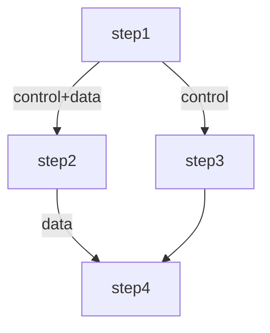

## Context

taskx 是 common-tools 中的分布式任务编排框架，当前使用第三方库 `dominikbraun/graph` 管理 DAG。核心问题：

1. **破坏性图操作**：子任务完成后通过 `RemoveVertex`/`RemoveEdge` 删除节点，破坏了原始图结构，无法回溯或重放
2. **依赖与数据流耦合**：单一有向边同时表达执行依赖和数据传递，无法表达"只等完成不传数据"或"只传数据不阻塞"的语义
3. **缺乏条件分支**：所有子任务路径必须执行，无法根据运行时条件选择分支
4. **无编译校验**：图构建后直接运行，缺少环检测和类型校验阶段
5. **无类型安全**：Input/Output 全部为 string，类型信息在序列化时丢失
6. **无 Context 传播**：SubTaskExecutor 没有 ctx 参数，无法做超时控制和取消传播
7. **全局执行器注册**：使用包级全局变量 `_em`，无法测试隔离和多实例
8. **回滚策略硬编码**：只能按逆拓扑序回滚所有已执行子任务
9. **无可观测性**：缺少执行过程中的回调机制

参考 eino 项目的 DAG 设计，对 taskx 进行全面重构。

### 当前架构

```
Task
 ├── subTasks []*Subtask
 ├── subtaskMap map[string]*Subtask
 ├── g graph.Graph[string, *Subtask]    ← dominikbraun/graph，单一有向边
 └── rollbacks []*Subtask

全局变量: _em executorManager (包级全局，无法隔离)

调度流程: handleTask → analysisTask → NextSubTasks(找入度0节点) → allocateWorker → deliverToCluster
子任务完成: updateSubtaskState → RemoveEdge + RemoveVertex (破坏性)
```

### 目标架构

```
Task (实例级，包含执行器注册)
 ├── dag *dagGraph                    ← 自建图结构，控制/数据边分离
 ├── compiled *compiledDAG            ← 编译后不可变产物
 ├── executorManager *executorManager ← 实例级，非全局
 ├── callback DAGCallback             ← 生命周期回调
 └── rollbackStrategy RollbackStrategy

Subtask[I, O]
 ├── triggerMode NodeTriggerMode
 ├── timeout time.Duration
 ├── priority int
 ├── preProcessor / postProcessor
 └── state NodeState (非破坏性)

调度流程: Compile → handleTask → NextSubTasks(dagChannel状态查询) → allocateWorker → deliverToCluster
子任务完成: updateNodeState (更新状态，不删除节点) → reportValues/reportDependencies → dagChannel 传播
```

## Goals / Non-Goals

**Goals:**
- 实现控制依赖与数据依赖分离，支持更灵活的编排语义
- 实现非破坏性状态管理，子任务完成后保留图结构
- 支持条件分支，允许运行时动态选择执行路径
- 支持 AnyPredecessor / AllPredecessor 两种节点触发模式
- 支持 Skip 机制，前驱跳过时后继可自动跳过
- 引入图编译阶段，提前校验图合法性
- 支持字段级数据映射
- 支持泛型类型安全，编译时校验节点间类型兼容
- 支持 Context 传播和子任务级超时控制
- 执行器注册改为实例级，支持依赖注入和测试隔离
- 回滚策略可配置
- 支持 Pre/Post Processor 横切关注点
- 支持执行回调（可观测性）
- 支持子图嵌套
- 支持优先级调度
- 支持图可视化（DOT/Mermaid）

**Non-Goals:**
- 不实现流式处理（eino 的 Stream/Collect/Transform 模式），taskx 是任务调度框架非 AI 推理框架
- 不实现 Pregel 超步迭代模式（taskx 不需要处理含环图）
- 不实现 Checkpoint/中断恢复机制（可作为后续迭代）
- 不替换底层存储和集群调度机制
- 不改变 gRPC 通信协议的基础结构

## Decisions

### Decision 1: 自建轻量图结构，移除 dominikbraun/graph 依赖

**选择**：自建 `dagGraph` 结构体，内化图管理逻辑

**理由**：
- dominikbraun/graph 不支持控制/数据边分离，扩展成本高
- 自建图结构可以精确控制状态管理，实现非破坏性节点状态跟踪
- 减少外部依赖，图操作逻辑并不复杂

**图结构设计**：
```go
type dagGraph struct {
    nodes    map[string]*dagNode
    edges    []*dagEdge          // 保留所有边，不删除
    // 邻接表（编译后不可变）
    controlAdj    map[string][]string
    controlPred   map[string][]string
    dataAdj       map[string][]string
    dataPred      map[string][]string
    branches      map[string][]*Branch
    compiled      bool
}

type dagEdge struct {
    from     string
    to       string
    edgeType EdgeType    // ControlEdge | DataEdge
    mappings []*FieldMapping
}

type dagNode struct {
    key         string
    subtask     *Subtask
    triggerMode NodeTriggerMode
    state       NodeState
    priority    int
    timeout     time.Duration
    preProcessor  Processor
    postProcessor Processor
}
```

### Decision 2: dagChannel 状态管理模型

**选择**：参考 eino 的 dagChannel，为每个节点维护依赖状态

```go
type dagChannel struct {
    nodeKey             string
    controlPredecessors map[string]dependencyState
    dataPredecessors    map[string]bool
    values              map[string]any
    skipped             bool
}

type dependencyState uint8
const (
    depWaiting  dependencyState = iota
    depReady
    depSkipped
)
```

**核心逻辑**：
- `reportValues(ins map[string]any)`：前驱节点完成后报告输出值
- `reportDependencies(deps []string)`：前驱节点完成后报告控制依赖就绪
- `reportSkip(keys []string) bool`：前驱节点跳过时报告，若所有控制前驱都跳过则当前节点也跳过
- `get() (any, bool, error)`：检查是否所有依赖就绪，返回合并后的输入数据

### Decision 3: 条件分支（Branch）设计

**选择**：在图级别支持 Branch，Branch 挂载在某个节点上

```go
type Branch struct {
    condition  func(ctx context.Context, input any) (string, error)
    endNodes   map[string]bool
}
```

**执行逻辑**：
- 分支节点执行完成后，调用 condition 函数确定下一个执行路径
- 未被选中的分支目标节点自动标记为 Skipped
- Branch 同时产生控制依赖和数据依赖

### Decision 4: 图编译阶段

**选择**：新增 `Compile()` 方法，编译后图不可变

**编译时校验**：
1. 环检测（拓扑排序验证 DAG 合法性）
2. 起始节点和终止节点检查
3. 类型兼容性校验（节点间输入输出类型匹配）
4. 字段映射合法性校验
5. Branch endNodes 存在性校验

**编译后产物**：
```go
type compiledDAG struct {
    graph         *dagGraph
    channels      map[string]*dagChannel
    branches      map[string][]*Branch
    startNodes    []string
    endNodes      []string
}
```

### Decision 5: 字段映射设计

**选择**：支持 FieldMapping，在 AddDataEdge 时指定字段映射

```go
type FieldMapping struct {
    SourceField string   // 源字段路径，如 "result.name"
    TargetField string   // 目标字段路径，如 "displayName"
}

func (t *Task) AddDataEdge(src, dst *Subtask, mappings ...*FieldMapping) error
```

**数据合并**：当节点有多个数据前驱时，将所有前驱的输出按字段映射合并为一个 map 作为当前节点输入。

### Decision 6: 泛型类型安全

**选择**：Subtask 使用泛型参数标注输入输出类型，Compile 阶段校验类型兼容

```go
type Subtask[I any, O any] struct {
    // ...
    inputType  reflect.Type
    outputType reflect.Type
}

// Compile 时校验：前驱的 outputType 必须兼容后继的 inputType
// 无字段映射时：前驱 O 必须可赋值给后继 I
// 有字段映射时：前驱 O 必须为 map 类型，且映射的源字段存在
```

**理由**：
- 编译时发现类型不匹配错误，而非运行时序列化失败
- 参考 eino 的 `checkAssignable` 机制

**权衡**：Go 泛型在运行时类型擦除，需通过 reflect 做运行时校验。但 Compile 阶段的一次性校验成本可接受。

### Decision 7: Context 传播与超时控制

**选择**：SubTaskExecutor 签名增加 ctx，子任务支持独立超时

```go
// 旧签名
type SubTaskExecutor func(data *TaskData) (output interface{}, err error)

// 新签名
type SubTaskExecutor func(ctx context.Context, data *TaskData) (output interface{}, err error)
```

**超时机制**：
```go
subtask.SetTimeout(30 * time.Second)

// 执行时
ctx, cancel := context.WithTimeout(parentCtx, subtask.timeout)
defer cancel()
output, err := executor(ctx, data)
```

**Context 传播链**：Task 提交时的 ctx → 调度器 → 子任务执行器，支持 traceID、取消信号等传播。

### Decision 8: 执行器注册改为实例级

**选择**：移除全局变量 `_em`，将 executorManager 作为 Task 实例的属性

```go
// 旧方式（全局注册）
RegisterTaskExecutor(myExecutor, subtaskExecutors)

// 新方式（实例级注册）
task := NewTask("my-task")
task.RegisterTaskExecutor(myExecutor, subtaskExecutors)
task.RegisterBranchCondition("branch1", conditionFunc)
```

**理由**：
- 全局变量无法并发安全地注册不同执行器
- 测试时无法隔离，多个测试用例互相影响
- 实例级注册支持同一个进程运行多个不同配置的 Task

### Decision 9: 回滚策略可配置

**选择**：支持三种回滚策略

```go
type RollbackStrategy int
const (
    RollbackAll    RollbackStrategy = iota  // 回滚所有已执行子任务（当前行为，默认）
    RollbackFailed                           // 只回滚失败子任务
    RollbackCustom                           // 自定义回滚逻辑
)

task.SetRollbackStrategy(RollbackFailed)

// 自定义回滚
task.SetRollbackStrategy(RollbackCustom)
task.SetCustomRollbackFunc(func(completedNodes []string, failedNode string) []string {
    // 返回需要回滚的节点列表
})
```

### Decision 10: Pre/Post Processor

**选择**：每个子任务支持挂载前置/后置处理器

```go
type Processor func(ctx context.Context, data any) (any, error)

subtask.SetPreProcessor(func(ctx context.Context, input I) (I, error) {
    log.Printf("subtask %s starting", subtask.key)
    return input, nil
})

subtask.SetPostProcessor(func(ctx context.Context, output O) (O, error) {
    metrics.Record(subtask.key, output)
    return output, nil
})
```

**执行顺序**：PreProcessor → SubTaskExecutor → PostProcessor

### Decision 11: DAGCallback 可观测性

**选择**：定义 DAGCallback 接口，在关键生命周期节点触发回调

```go
type DAGCallback interface {
    OnSubtaskStart(ctx context.Context, key string, input any)
    OnSubtaskComplete(ctx context.Context, key string, output any)
    OnSubtaskFailed(ctx context.Context, key string, err error)
    OnSubtaskSkipped(ctx context.Context, key string)
    OnBranchSelected(ctx context.Context, fromNode string, selectedNode string)
}

task.SetCallback(myCallback)
```

**与 Pre/Post Processor 的区别**：Callback 不修改数据，只做观察；Processor 可以修改数据。

### Decision 12: 子图嵌套

**选择**：支持将一个 Task 作为子图节点嵌入

```go
// 创建子图
subTask := NewTask("sub-workflow")
subTask.AddSubtask(step1)
subTask.AddSubtask(step2)
subTask.AddDataEdge(step1, step2)

// 将子图作为节点嵌入外层
mainTask.AddSubtaskGraph("sub-node", subTask)
mainTask.AddDataEdge(inputNode, subTaskNode)
mainTask.AddDataEdge(subTaskNode, outputNode)
```

**执行逻辑**：子图节点执行时，先编译子图，然后按子图内部 DAG 逻辑执行，子图整体完成后将最终输出作为节点输出。

### Decision 13: 优先级调度

**选择**：子任务支持优先级，调度时优先执行高优先级节点

```go
subtask.SetPriority(10)  // 数值越高越优先，默认 0
```

**调度逻辑**：NextSubTasks 返回的可执行节点按优先级降序排列，调度器优先分配高优先级节点。

### Decision 14: 图可视化增强

**选择**：支持输出 DOT 和 Mermaid 格式

```go
task.GraphDOT()      // Graphviz DOT 格式
task.GraphMermaid()  // Mermaid 格式
```

**输出示例（Mermaid）**：


### Decision 15: ExecutorProvider 执行器协议抽象（泛型化）

**选择**：将 `SubTaskExecutor` 抽象为泛型化的 `ExecutorProvider`，用泛型替代 `interface{}` 提供类型安全，同时支持本地函数、gRPC、HTTP、MCP 等多种执行协议

**理由**：
- 当前 `SubTaskExecutor` 只能注册本地 Go 函数，无法直接调用远程服务
- taskx 是集群框架，子任务可能被调度到不同节点执行，数据必须可序列化以支持网络传输
- 统一抽象后，DAG 编排层无需关心执行器的底层协议，只关注输入输出
- 使用泛型替代 `interface{}`，在编译时保证类型安全，减少运行时类型断言错误

**核心约束**：taskx 是集群框架，所有执行器的输入输出类型必须可序列化（`encoding/json` 兼容），因为：
1. 调度器将子任务分配到远程 Worker 节点执行，数据通过 gRPC 传输
2. 子任务状态和输出持久化到数据库
3. 远程执行器（gRPC/HTTP/MCP）天然需要序列化

**接口设计**：

```go
// ExecutorProvider 执行器提供者接口（最小接口，仅2个方法）
type ExecutorProvider interface {
    Execute(ctx context.Context, data *TaskData) (any, error)
    Protocol() ExecutorProtocol
}

// ExecutorProtocol 执行器协议类型
type ExecutorProtocol string
const (
    ProtocolLocal ExecutorProtocol = "local"
    ProtocolGRPC  ExecutorProtocol = "grpc"
    ProtocolHTTP  ExecutorProtocol = "http"
    ProtocolMCP   ExecutorProtocol = "mcp"
)
```

> `ExecutorProvider` 接口本身不可避免（多态需要），但各实现使用泛型消除 `interface{}`

**本地函数执行器（泛型）**：

```go
// executor/local.go
// LocalExecutor 本地函数执行器，泛型参数 I/O 提供编译时类型安全
type LocalExecutor[I any, O any] struct {
    fn func(ctx context.Context, input I) (O, error)
}

// NewLocalExecutor 创建本地函数执行器
// I 和 O 必须可 JSON 序列化（集群框架约束）
func NewLocalExecutor[I any, O any](fn func(ctx context.Context, input I) (O, error)) *LocalExecutor[I, O] {
    return &LocalExecutor[I, O]{fn: fn}
}

func (e *LocalExecutor[I, O]) Execute(ctx context.Context, data *TaskData) (any, error) {
    // 从 TaskData 反序列化到 I 类型（集群传输后数据为序列化字符串）
    var input I
    if err := data.UnmarshalInput(&input); err != nil {
        return nil, fmt.Errorf("local executor unmarshal input failed: %w", err)
    }
    // 调用类型安全的函数
    output, err := e.fn(ctx, input)
    if err != nil {
        return nil, err
    }
    return output, nil
}

func (e *LocalExecutor[I, O]) Protocol() ExecutorProtocol { return ProtocolLocal }
```

**gRPC 远程执行器（泛型）**：

```go
// executor/grpc.go
// GRPCExecutor gRPC 远程执行器，泛型参数指定请求/响应类型
type GRPCExecutor[I any, O any] struct {
    endpoint    string
    serviceName string
    methodName  string
    timeout     time.Duration
    dialOpts    []grpc.DialOption
}

func NewGRPCExecutor[I any, O any](endpoint, serviceName, methodName string, opts ...GRPCOption) *GRPCExecutor[I, O]

func (e *GRPCExecutor[I, O]) Execute(ctx context.Context, data *TaskData) (any, error) {
    // 1. 从 TaskData 反序列化到 I 类型
    var input I
    if err := data.UnmarshalInput(&input); err != nil {
        return nil, fmt.Errorf("grpc executor unmarshal input failed: %w", err)
    }
    // 2. 序列化 I 为 protobuf/JSON → gRPC 调用 → 反序列化响应到 O
    // 3. 返回 O 类型结果
}

func (e *GRPCExecutor[I, O]) Protocol() ExecutorProtocol { return ProtocolGRPC }
```

**HTTP 远程执行器（泛型）**：

```go
// executor/http.go
// HTTPExecutor HTTP 远程执行器，泛型参数指定请求体/响应体类型
type HTTPExecutor[I any, O any] struct {
    url         string
    method      string            // GET/POST/PUT
    headers     map[string]string
    timeout     time.Duration
}

func NewHTTPExecutor[I any, O any](url, method string, opts ...HTTPOption) *HTTPExecutor[I, O]

func (e *HTTPExecutor[I, O]) Execute(ctx context.Context, data *TaskData) (any, error) {
    // 1. 从 TaskData 反序列化到 I 类型
    var input I
    if err := data.UnmarshalInput(&input); err != nil {
        return nil, fmt.Errorf("http executor unmarshal input failed: %w", err)
    }
    // 2. 序列化 I 为 JSON → HTTP 请求 → 反序列化响应到 O
    // 3. 返回 O 类型结果
}

func (e *HTTPExecutor[I, O]) Protocol() ExecutorProtocol { return ProtocolHTTP }
```

**MCP 工具执行器**：

```go
// executor/mcp.go
// MCPExecutor MCP 工具执行器
// MCP 协议输入输出为 JSON Schema 定义，天然动态，不使用泛型
type MCPExecutor struct {
    serverURL string
    toolName  string
    timeout   time.Duration
}

func NewMCPExecutor(serverURL, toolName string, opts ...MCPOption) *MCPExecutor

func (e *MCPExecutor) Execute(ctx context.Context, data *TaskData) (any, error) {
    // 1. 将 TaskData.Input 作为 JSON 参数
    // 2. 构造 MCP tools/call 请求 → HTTP/SSE 调用 → 解析结果
    // 3. 返回 map[string]any 类型的结构化结果
}

func (e *MCPExecutor) Protocol() ExecutorProtocol { return ProtocolMCP }
```

> MCP 不使用泛型的原因：MCP 工具的输入输出由 JSON Schema 定义，运行时动态发现，无法在编译时确定类型

**注册 API（泛型友好）**：

```go
// 方式1：注册泛型 ExecutorProvider（推荐）
task.RegisterProviders(myExecutor, map[string]ExecutorProvider{
    "step1": NewLocalExecutor(func(ctx context.Context, input MyInput) (MyOutput, error) {
        // 类型安全，无需类型断言
        return MyOutput{Result: input.Name + "_processed"}, nil
    }),
    "step2": NewGRPCExecutor[MyInput, MyOutput]("localhost:50051", "MyService", "Process"),
    "step3": NewHTTPExecutor[MyRequest, MyResponse]("http://api.example.com/process", "POST"),
    "step4": NewMCPExecutor("http://mcp-server:8080", "my-tool"),
})

// 方式2：便捷方法，注册本地函数（自动包装为 LocalExecutor）
task.RegisterTaskExecutor(myExecutor, map[string]SubTaskExecutor{
    "step1": localFunc,
})
// 内部自动转换为 LocalExecutor[any, any]，向后兼容
```

**executorManager 适配**：

```go
type executorManager struct {
    taskExecutors    map[string]TaskExecutor
    subtaskProviders map[string]map[string]ExecutorProvider  // Provider 注册
    subtaskExecutors map[string]map[string]SubTaskExecutor  // 向后兼容
    // ...
}

// RegisterProviders 批量注册 ExecutorProvider
func (em *executorManager) registerProviders(taskName string, providers map[string]ExecutorProvider) {
    if em.subtaskProviders[taskName] == nil {
        em.subtaskProviders[taskName] = make(map[string]ExecutorProvider)
    }
    for name, p := range providers {
        em.subtaskProviders[taskName][name] = p
    }
}

// getProvider 获取执行器（优先 Provider，否则包装旧 SubTaskExecutor）
func (em *executorManager) getProvider(taskName, subTaskName string) ExecutorProvider {
    if providers, ok := em.subtaskProviders[taskName]; ok {
        if p, ok := providers[subTaskName]; ok {
            return p
        }
    }
    // 向后兼容：将旧 SubTaskExecutor 包装为 LocalExecutor
    if executors, ok := em.subtaskExecutors[taskName]; ok {
        if fn, ok := executors[subTaskName]; ok {
            return &legacyExecutorWrapper{fn: fn}
        }
    }
    return nil
}

// legacyExecutorWrapper 向后兼容包装器
type legacyExecutorWrapper struct {
    fn SubTaskExecutor
}
func (w *legacyExecutorWrapper) Execute(ctx context.Context, data *TaskData) (any, error) {
    return w.fn(ctx, data)
}
func (w *legacyExecutorWrapper) Protocol() ExecutorProtocol { return ProtocolLocal }
```

**集群框架下的数据流**：

```
调度器节点                          Worker节点
─────────                          ─────────
TaskData (序列化)  ──gRPC──→  TaskData (反序列化)
                              ↓
                         ExecutorProvider.Execute()
                              ↓
                    ┌─ LocalExecutor[I,O]: 反序列化→I → fn(I)O → 返回O
                    ├─ GRPCExecutor[I,O]:  反序列化→I → gRPC调用 → 反序列化→O
                    ├─ HTTPExecutor[I,O]:  反序列化→I → HTTP调用 → 反序列化→O
                    └─ MCPExecutor:        直接传JSON → MCP调用 → 返回map
                              ↓
                    output (any) → 序列化 → 存储到数据库
```

**权衡**：
- **优势**：泛型提供编译时类型安全，本地函数和远程调用均无需 `interface{}` 类型断言
- **优势**：DAG 编排层与执行协议解耦，新增协议只需实现 ExecutorProvider 接口
- **优势**：向后兼容，旧的 SubTaskExecutor 注册方式自动包装
- **约束**：泛型参数 I/O 必须可 JSON 序列化（集群框架硬性要求）
- **风险**：远程执行器引入网络不可靠性，需要合理的超时和重试策略
- **权衡**：MCP 不使用泛型，因为其输入输出由 JSON Schema 运行时定义

## Risks / Trade-offs

- **[风险] 数据库模型变更** → 需要数据库迁移，Subtask 表新增字段。缓解：提供迁移脚本
- **[风险] 全面重构 API** → 所有使用方需适配新 API。缓解：taskx 尚无实际应用，影响可控
- **[风险] 自建图结构的正确性** → 自建图结构需确保环检测、拓扑排序等算法正确。缓解：编写充分的单元测试，参考 eino 的 validateDAG 实现
- **[风险] 泛型与 reflect 的复杂度** → 运行时类型校验依赖 reflect，可能引入边界情况。缓解：Compile 阶段集中处理，运行时零开销
- **[权衡] 性能** → 非破坏性状态管理意味着图结构始终完整，内存占用略增。对于 taskx 的任务规模（通常几十到几百个子任务），影响可忽略
- **[权衡] 复杂度增加** → 大量新特性增加了 API 复杂度。缓解：提供合理的默认值和便捷方法，降低简单场景的使用门槛
